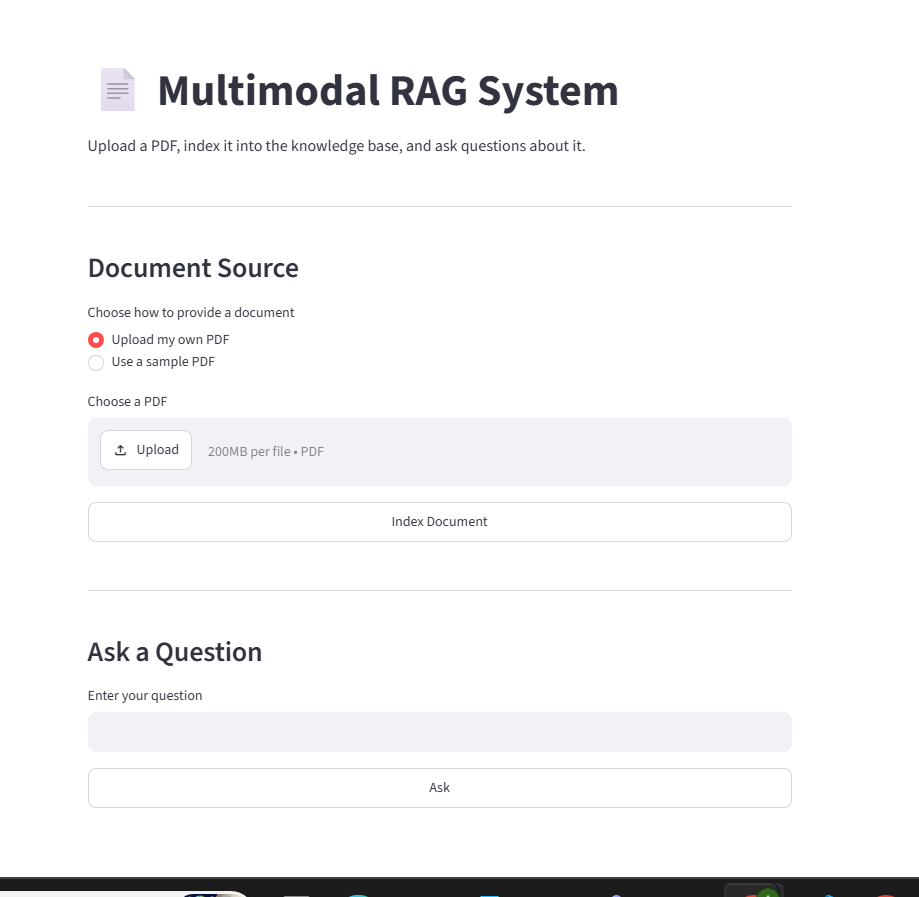
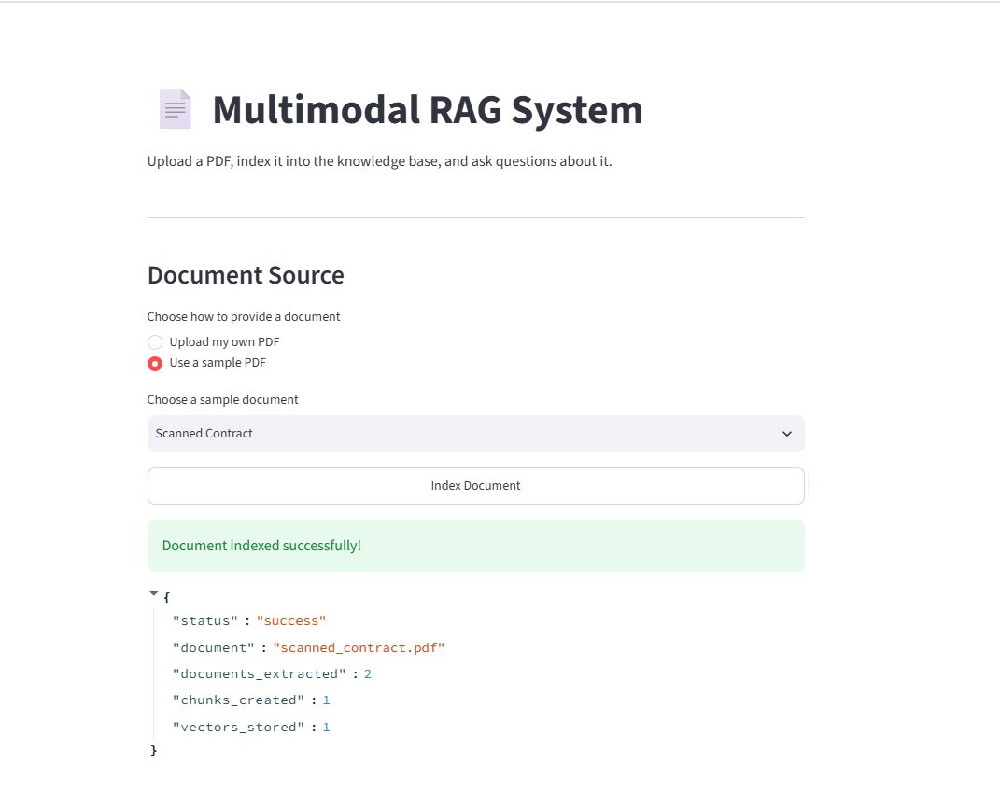
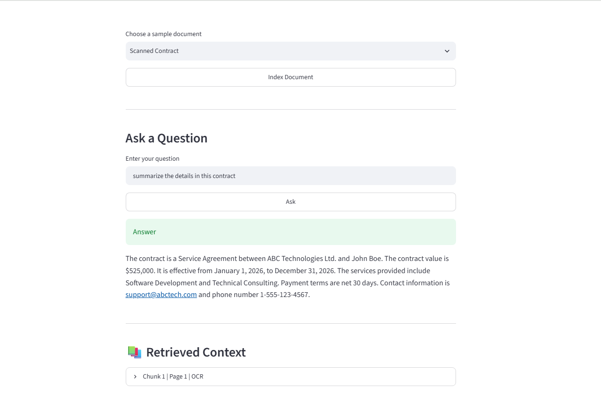
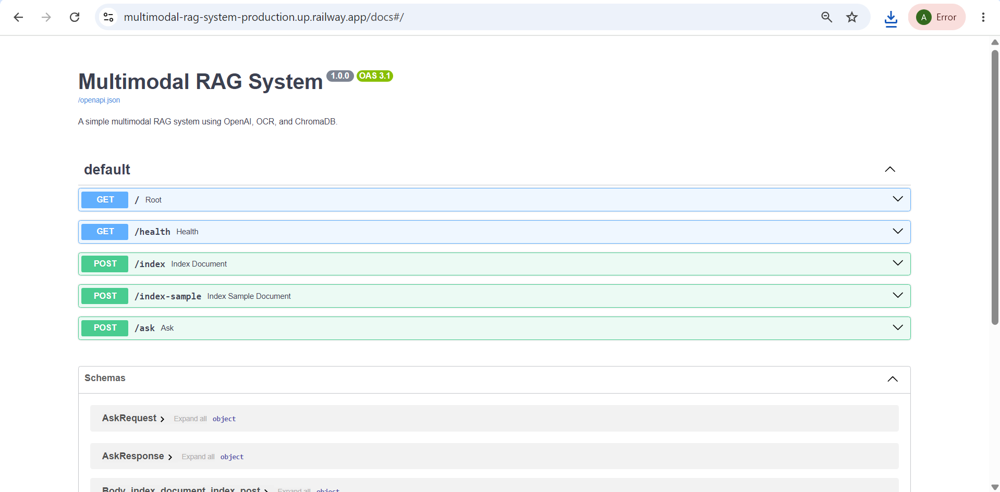
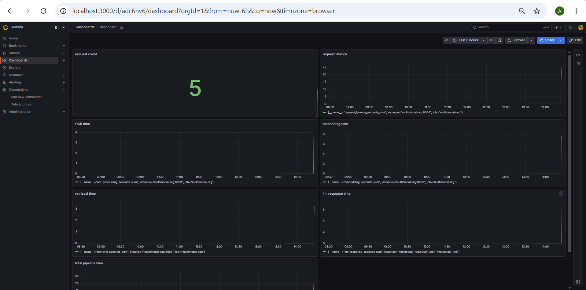

# 📄 Multimodal RAG System

> A production-style **Multimodal Retrieval-Augmented Generation (RAG)** application that understands text-based and scanned PDF documents using OCR, semantic search, vector embeddings, and OpenAI.


---

# 🌐 Live Demo

| Service | URL |
|----------|-----|
| 🚀 Streamlit App | https://outstanding-happiness-production-85c2.up.railway.app/ |
| ⚙️ FastAPI Backend | https://multimodal-rag-system-production.up.railway.app |
| 📚 Swagger API Docs | https://multimodal-rag-system-production.up.railway.app/docs |

---

# 🚀 Overview

This project is an end-to-end **Multimodal Retrieval-Augmented Generation (RAG)** system capable of answering questions from PDF documents containing both machine-readable text and scanned images.

Unlike a traditional chatbot, this application performs a complete document intelligence pipeline:

- 📄 PDF Processing
- 🖼 OCR Extraction
- ✂ Intelligent Text Chunking
- 🧠 OpenAI Embedding Generation
- 🗄 ChromaDB Vector Storage
- 🔍 Semantic Retrieval
- 🤖 LLM Answer Generation

The project is designed using production-inspired software engineering practices including modular architecture, Docker, monitoring, testing, CI/CD, and cloud deployment.

---

# ✨ Features

- 📄 Upload custom PDF documents
- 📚 Built-in sample documents
- 🖼 OCR extraction using Tesseract
- ✂ Intelligent text chunking
- 🧠 OpenAI Embeddings
- 🗄 ChromaDB Vector Database
- 🔍 Semantic Search
- 🤖 Retrieval-Augmented Generation (RAG)
- ⚡ FastAPI REST API
- 🎨 Streamlit Web Interface
- 🐳 Dockerized deployment
- 📊 Prometheus Metrics
- 📈 Grafana Dashboards
- ✅ Pytest API Testing
- 🔄 GitHub Actions CI
- ☁️ Railway Cloud Deployment

---
# 📸 Screenshots

## Streamlit Application


---

## Document Indexing


---

## Question Answering


---

## Swagger API


---

## Grafana Dashboard


---

# 🏗️ System Architecture

```
                    PDF Upload
                         │
                         ▼
                  PDF Processing
                         │
         ┌───────────────┴───────────────┐
         ▼                               ▼
 Text Extraction                  OCR Extraction
         │                               │
         └───────────────┬───────────────┘
                         ▼
                 Intelligent Chunking
                         ▼
              OpenAI Embedding Model
                         ▼
                  ChromaDB Storage
                         ▼
                 Semantic Retrieval
                         ▼
                  OpenAI GPT Model
                         ▼
                   Generated Answer
```

---

# 📂 Project Structure

```text
Multimodal-Rag-System
│
├── app/
│   ├── api/
│   ├── core/
│   ├── services/
│   ├── monitoring/
│   ├── schemas/
│   └── main.py
│
├── tests/
│
├── docs/
│
├── streamlit_app.py
│
├── Dockerfile
├── docker-compose.yml
├── prometheus.yml
│
├── pyproject.toml
├── uv.lock
│
└── README.md
```

---

# ⚙️ Tech Stack

| Category | Technology |
|-----------|------------|
| Language | Python 3.13 |
| Backend | FastAPI |
| Frontend | Streamlit |
| LLM | OpenAI GPT-4.1 |
| Embeddings | OpenAI text-embedding-3-small |
| Vector Database | ChromaDB |
| OCR | Tesseract OCR |
| PDF Processing | PyMuPDF + pdfplumber |
| Monitoring | Prometheus |
| Dashboards | Grafana |
| Testing | Pytest |
| Containerization | Docker |
| Package Manager | uv |
| Deployment | Railway |
| CI | GitHub Actions |

---

# 🔌 API Endpoints

| Method | Endpoint | Description |
|----------|----------|-------------|
| GET | `/` | Root endpoint |
| GET | `/health` | Health Check |
| POST | `/index` | Upload & Index PDF |
| POST | `/index-sample` | Index Sample PDF |
| POST | `/ask` | Ask Questions |
| GET | `/metrics` | Prometheus Metrics |
| GET | `/docs` | Swagger Documentation |

---

# 📊 Monitoring

The application exposes production-style metrics including:

- API Request Count
- API Latency
- OCR Processing Time
- Embedding Generation Time
- Retrieval Latency
- LLM Response Time
- Total Pipeline Latency

Metrics Endpoint:

```text
/metrics
```

Visualized using Grafana dashboards.

---

# 🐳 Docker

Build containers

```bash
docker compose build
```

Start services

```bash
docker compose up
```

Available Services

| Service | URL |
|----------|-----|
| Backend | http://localhost:8000 |
| Swagger | http://localhost:8000/docs |
| Streamlit | http://localhost:8501 |
| Prometheus | http://localhost:9090 |
| Grafana | http://localhost:3000 |

---

# 💻 Local Development

Clone the repository

```bash
git clone https://github.com/Abdullahalam379/Multimodal-Rag-System.git
```

Move into the project

```bash
cd Multimodal-Rag-System
```

Install dependencies

```bash
uv sync
```

Run FastAPI

```bash
uv run uvicorn app.main:app --reload
```

Run Streamlit

```bash
streamlit run streamlit_app.py
```

---

# 🔑 Environment Variables

Create a `.env` file.

```env
OPENAI_API_KEY=your_openai_api_key
```

---

# 🧪 Testing

Run all tests

```bash
pytest
```

Current coverage includes:

- Root Endpoint
- Health Endpoint
- Document Indexing
- Sample Document Indexing
- Question Answering

---

# 🔄 CI/CD

Every push and pull request automatically:

- Installs dependencies
- Runs the test suite
- Verifies project builds successfully

Powered by **GitHub Actions**.

---

# 🛣️ Roadmap

- User Authentication
- User-specific Vector Stores
- Hybrid Search (BM25 + Dense Retrieval)
- Redis Caching
- Multiple LLM Providers
- Kubernetes Deployment
- AWS Deployment
- Continuous Deployment
- Integration Tests
- Load Testing

---

# 📚 Learning Outcomes

This project demonstrates practical experience with:

- Retrieval-Augmented Generation (RAG)
- Multimodal AI Systems
- OCR Pipelines
- Semantic Search
- Vector Databases
- FastAPI Development
- Streamlit
- Docker
- CI/CD
- Monitoring & Observability
- Production-style Backend Engineering
- Cloud Deployment

---

# 👨‍💻 Author

**Abdullah Alam**

**Aspiring AI/ML Engineer**  
Building projects in **RAG, Agentic AI, Multi-Agent Systems, Automation, and MLOps**.

### GitHub

https://github.com/Abdullahalam379

### LinkedIn

https://linkedin.com/in/alam-abdullah/

---

# ⭐ Support

If you found this project useful, please consider giving it a ⭐ on GitHub. It helps others discover the project and supports my work.